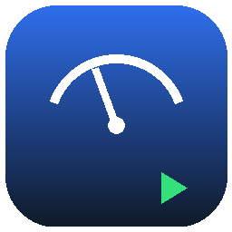

# BeamPlay — a CarPlay-inspired dash for BeamNG.drive

BeamPlay is a real BeamNG.drive **UI App** mod: a draggable, resizable
on-screen widget (the same mechanism the game uses for its built-in
speedometer, map, and fuel gauge apps) styled like a phone mounted on the
dash, CarPlay/Android-Auto style. It's built entirely on BeamNG's public UI
modding API — no game files are patched and no third-party audio/map assets
are bundled.



## What it actually does

Everything below is live, backed by BeamNG's `StreamsManager`
(`electrics` / `engineInfo` streams) or by data BeamPlay computes itself —
nothing is a static mockup:

- **Dashboard** — live digital speed, gear, an RPM bar that flags red near
  redline, fuel %, water/oil temp (temperature and fuel tiles show `--`
  gracefully on a vehicle/version that doesn't expose those fields, instead
  of a fake reading).
- **Trip computer** — session distance, elapsed time, average speed and top
  speed, all computed client-side from the vehicle's `electrics.trip`
  odometer and a wall-clock timer, with a reset button.
- **Status** — low/high beam, hazards and parking-brake indicators.
- **BeamPlay Radio** — a real, playable "radio" with four stations. There
  are no bundled MP3s (avoids bloat and licensing issues) — each station is
  a small generative synth sequence rendered live with the browser's Web
  Audio API, which is exactly the tech BeamNG's own CEF-based UI runs on.
  Play/pause, next/prev station and a volume slider all work.
- **Settings** — metric/imperial toggle and 12h/24h clock, persisted with
  `localStorage` so they survive restarts.
- A real-world clock and an automatic day/night colour theme in the status
  bar, like an actual CarPlay unit.

## Install (2 minutes)

BeamNG UI apps live in the game's `ui/modules/apps/` folder. The quickest
way to try BeamPlay is to drop the app folder straight in:

1. Locate your BeamNG install's UI apps folder, e.g. on Windows:
   `C:\Program Files (x86)\Steam\steamapps\common\BeamNG.drive\ui\modules\apps\`
   (or wherever Steam/the standalone installer put it).
2. Copy this repo's `ui/modules/apps/BeamPlay` folder into that directory,
   so you end up with
   `...\BeamNG.drive\ui\modules\apps\BeamPlay\app.json` etc.
3. Launch BeamNG, load into a vehicle, open the **Apps** menu (top-right
   gear/grid icon in the driving UI) and drag **BeamPlay** onto your
   screen.

### Installing as a `mods/` package instead

If you'd rather install it the same way downloaded mods work (via
`Documents/BeamNG.drive/<version>/mods/`), zip up the `ui/` folder here
(so the zip's root contains `ui/modules/apps/BeamPlay/...`, matching the
game's own folder layout) into e.g. `BeamPlay.zip`, then drop that zip into
`Documents/BeamNG.drive/<version>/mods/`. BeamNG mounts mod zips without
unpacking them, and the app will show up in the in-game Apps menu exactly
the same way.

```
# from the repo root:
zip -r BeamPlay.zip ui
# -> BeamPlay.zip, ready to drop in the mods/ folder
```

## Verifying it works

This repo can't launch BeamNG itself, so verification is split two ways:

1. **Automated** — every piece of logic that doesn't need the game (unit
   conversion, gear-text formatting, RPM-bar math, trip-time formatting,
   status-flag parsing, radio station cycling, note-frequency math) is a
   plain, dependency-free JS function, unit tested with Node's built-in
   test runner:

   ```
   npm test
   ```

   22 tests cover the math and formatting BeamPlay's UI displays.

2. **Manual, in-game** (do this after installing, to confirm the Angular/
   BeamNG-glue half — the part that can't run outside the game):
   - [ ] App appears in the in-game Apps picker and can be dragged onto the HUD.
   - [ ] Home screen shows five app icons; tapping each opens its screen and
         "‹ Home" returns to the grid.
   - [ ] With the engine running, Dashboard speed/gear/RPM bar track the
         vehicle in real time.
   - [ ] Trip screen's distance/timer increase while driving; **Reset
         trip** zeroes them.
   - [ ] Status screen's low-beam/hazard/parking-brake tiles light up when
         you toggle those in-game.
   - [ ] Radio: tapping ▶ produces audible synth audio; ⏮/⏭ change station
         and the audio changes; the volume slider changes loudness.
   - [ ] Settings: switching Metric/Imperial changes the units shown on
         Dashboard/Trip; the choice survives closing and reopening the app.

## Why the file layout looks like this

```
.
├── ui/modules/apps/BeamPlay/   ← the actual mod (mirrors BeamNG's own folder layout)
│   ├── app.json                ← manifest: name, default size/position, directive
│   ├── app.html                ← AngularJS template (home grid + 5 screens)
│   ├── app.css                 ← styling
│   ├── app.js                  ← pure logic (Node-testable) + the Angular directive
│   └── app.png                 ← app-picker icon
├── generate_icon.py            ← regenerates app.png (Pillow); not needed at runtime
├── tests/logic.test.js         ← Node test-runner suite for the pure logic in app.js
├── package.json                ← `npm test` entry point
└── README.md
```

`ui/modules/apps/BeamPlay/` is exactly the path BeamNG expects inside its
own install folder or inside a mod zip — that's why it's nested three
levels deep instead of flattened.

## Notes on the underlying BeamNG UI API

BeamPlay follows the same pattern used by other published BeamNG UI-app
mods (cross-checked against two independently maintained ones):

- Apps register as AngularJS directives on `angular.module('beamng.apps')`,
  with `templateUrl`/`domElement` wired up in `app.json`.
- Live telemetry comes from `StreamsManager.add([...])` plus a
  `$scope.$on('streamsUpdate', function (event, streams) { ... })`
  listener, cleaned up on `$scope.$on('$destroy', ...)`.
- Speed reads `electrics.wheelspeed` (falling back to `electrics.airspeed`);
  gear and RPM read fixed indices of the `engineInfo` array (`[16]` gear,
  `[4]` current RPM, `[1]` redline, `[0]` idle RPM) — the same indices used
  by other published gauge mods.
- Optional fields (`fuel`, `watertemp`, `oiltemp`, `lowbeam`, `highbeam`,
  `signal_L`/`signal_R`, `hazard_enabled`, `parkingbrake`) are read
  defensively: if a vehicle/BeamNG version doesn't expose one, BeamPlay
  shows a neutral "n/a"/`--` instead of guessing.
